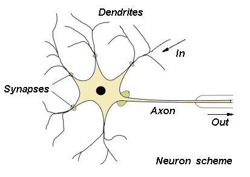
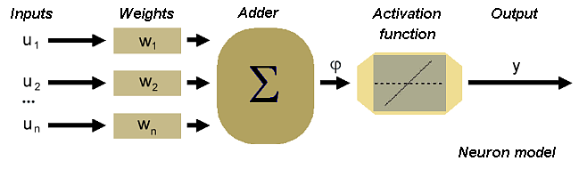
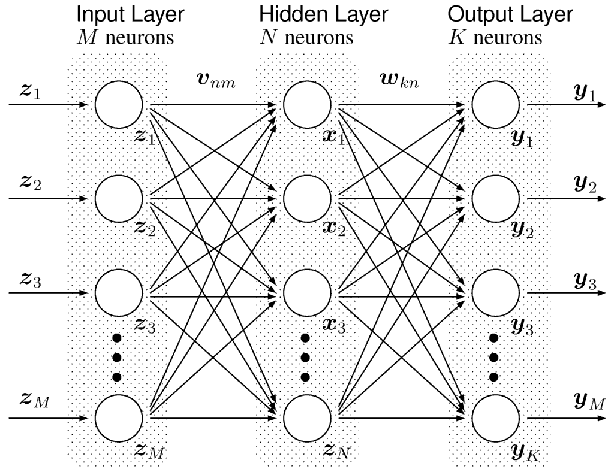

# Introduction

By browsing through the web we realized that there are not so many neural network libraries
with an simple and intuitive user interface available. We thought that it
would be very interesting to construct a neural network in an easy way by
defining the types of the basic components a typical neural network consists of.
The main goal of this project actually is to provide a modern c++ framework,
flexible enough to reconstruct different neural network topologies in just few lines of code.

Spending some time in investigation and reading the basic ideas around the artifical
neural networks we came to a conclusion that a typical neural network is not something
monolythic but it consists of the smaller parts. Which are these small parts in this case?
Well the most known to us (and biology scinetists) is a neuron. This is the point where it all
begins from :). I am about to grab some images from the google to show how the neuron looks like
in a nature and how we represent it in a software.

here it is:



I intentially selected an image which is showing a data flow through the biological neuron.
How would you design this thing in a software? Well lets do some OOA first. Which parts of
the neuron are interested for us? So from the image above we can see at least 3 different parts
of the physical neuron.

- Dendrites
- Cell body
- Axon

Then lets take a look how the neuron is designed as a mathematical model

here we are:



# Design

So lets do some mapping between the mathematical representation and biological instance of an neuron.
Dendrites are the Inputs for a neuron. So Input class.
Cell body is an actuall body of a neuron therefore can be represented as a Neuron class.
Axon is represented as an activation function in a neuron. Activation function should be exchangable
because different activation functions are more or less suitable on solving different types of problems.

=== Neuron

The uml diagram of an neuron is shown below.

---

```plantuml
class Neuron< T >
Neuron *-- IActivationFunction
Neuron ..> NeuronMemento
Neuron ..|> INeuron

IActivationFunction <|.. TahnFunction
IActivationFunction <|.. SigmoidFunction
IActivationFunction <|.. SoftmaxFunction
IActivationFunction <|.. LogScaleSoftmaxFunction
IActivationFunction <|.. BiopolarSigmoidFunction
@enduml
```

---

Neuron is a basic brick of any artificial neural network, since we have it we can construct any type of the nn
just by reusing this class.

# NeuralLayer

```cpp
template<
	 template<template<class> class, class, unsigned int, bool> class NeuronType,
         template<class> class ActivationFunctionType,
	 unsigned int size,
	 unsigned int inputsNumber = 2,
	 bool isDynamic = false,
	 typename Var = float
         >
using NeuralLayer = detail::NeuralLayer< NeuronType<ActivationFunctionType, Var, inputsNumber, isDynamic >, size, inputsNumber, isDynamic >;
```

---

- NeuronType the type of the neurons used in this layer.
- ActivationFunctionType the activation function type used in each of the corresponding neurons.
- size the number of neurons in a neural layer.
- inputs number the number of the inputs for the current layer.
- isDynamic defines the underlying collection type if false then it will be the std::array otherwise std::vector
  there are some learning algorithms which requires to have a floating number of neurons in a layer.
- Var the variable type used in this layer.

---

Perceptron
===
Now lets take a look on one possible model of an artificial neural network, called
perceptron. Perceptron consists of the layers. Each layer has more than 0 neurons and amount of neurons in each
level strongly depends on the problem definition. For instance if we want to solve a simple XOR problem so that
teach our network to recognize a different types of inputs and output the particular output like in the following
table:

| Input1 | Input2 | Output |
| ------ | :----: | -----: |
| 0      |   0    |      0 |
| 0      |   1    |      1 |
| 1      |   1    |      0 |
| 1      |   0    |      1 |

Then we need two inputs in the input layer and one output (neuron) in the output layer. In tnnlib we don't really
have an input layer instead the number of inputs for a layer is defined as a template argument. So perceptron in
tnnlib starts with the hidden layer.

Neural network example

There are three different types of the layers in perceptron.

---

- InputLayer
- HiddenLayer
- OutputLayer

---

The only difference between the layers is the place where these layers are placed in a perceptron.

## example with the code:

```cpp
typedef nn::Perceptron<float,
	nn::NeuralLayer<nn::Neuron, nn::SigmoidFunction, 3, 2>,
	nn::NeuralLayer<nn::Neuron, nn::TanhFunction, 20>,
	nn::NeuralLayer<nn::Neuron, nn::SigmoidFunction, 1>
	> Perceptron;
```

---

Here we have a definition of a three (2 hidden - one output) layers perceptron. The number of inputs
is 2 see the third template argument of the first hidden layer. Thun number of neurons in a first
hidden layer is 3. The second hidden layer consists of 20 neurons and tnnlib will magically calculate
the amount of inputs needed for the second hidden layer. Finally we have an output layer which
consists only on one neuron. This neuron is rosponsible to provide the final result - decision for the
given input.

The definition of the perceptron class is available in a Perceptron.h file

---

```cpp
template<typename VarType, typename... NeuralLayers>
using Perceptron = detail::Perceptron<VarType, std::tuple<NeuralLayers...> >;
```

---

- VarType : the type of the internal variable representing the data - usually float or any other type with the floatin point and possibility to initialize by float.
- NeuralLayers a list of the neural layers. Each entry in this list should conform the INeuralLayer interface.

---



# Template based intefaces

Since in c++ we still don't have an official support for a concepts we decided to use the
CRTP - http://en.wikipedia.org/wiki/Curiously_recurring_template_pattern in order to create a conceptial interfaces in our implementation.
An example of a neuron interface is following

```cpp
---------------------------------------------------------------------
template<class Neuron>
class INeuron {
public:
    typedef typename Neuron::Var Var;
    typedef typename Neuron::OutputFunction OutputFunction;
    typedef typename Neuron::Memento Memento;
    typedef typename Neuron::Input Input;
    typedef Neuron NeuronType;

private:
    Neuron m_neuron;

public:
    INeuron();
    INeuron ( Neuron neuron ) :m_neuron ( neuron );
    template<typename Iterator>
    const Var& calculateOutput (Iterator begin, Iterator end);
    std::size_t size ( ) const;
    Input& operator [] (std::size_t id);
    Var getOutput() const;
    Var calcDotProduct()const;
    void setInput ( std::size_t inputId, const Var& value );
    bool setWeight ( std::size_t weightId, const Var& weight );
    const Var& getBias () const;
    void setBias ( Var weight );
    const Var& getWeight (std::size_t weightId) const;
    const Memento getMemento() const;
    Neuron& operator*();
    const Neuron& operator*()const;
    const Neuron* operator->() const;
    Neuron* operator->();
    ~INeuron() {}
};
```

---

The interface simply wraps the template argument and propagate all the call into it.
This concept is used all over the place in a tnn library.

# class diagram

In the following diagram not all the "inheritance" relations are a real inheritance relations. This is an attempt to
describe the CRTP in UML language. Especially it is true for the interfaces realization such as INeuralLayer, INeuron and IActivationFunction.

```plantuml

interface INeuralLayer< T >
interface INeuron < T >
interface IActivationFunction< T >
class Perceptron
class PerceptronMemento
class NeuralLayer<T>
class NeuralLayerMemento
class Neuron<T>
class NeuronMemento
class ComplexLayer

class BPNeuralLayer
class BPNeuron

class TahnFunction
class SigmoidFunction
class SoftmaxFunction
class LogScaleSoftmaxFunction
class BiopolarSigmoidFunction

Neuron *-- IActivationFunction
Neuron ..> NeuronMemento
Neuron ..|> INeuron
NeuralLayer ..|> INeuralLayer
NeuralLayer ..> NeuralLayerMemento
Perceptron *-- "many" INeuralLayer
Perceptron ..> PerceptronMemento
NeuralLayer *-- "many" INeuron
ComplexLayer *-- Perceptron
ComplexLayer ..|> INeuralLayer

BPNeuralLayer --|> NeuralLayer
BPNeuron --|> Neuron

BepAlgorithm ..> Perceptron
BepAlgorithm ..> BPNeuralLayer
BepAlgorithm ..> BPNeuron
BepAlgorithm ..> ErrorFunction

IActivationFunction <|.. TahnFunction
IActivationFunction <|.. SigmoidFunction
IActivationFunction <|.. SoftmaxFunction
IActivationFunction <|.. LogScaleSoftmaxFunction
IActivationFunction <|.. BiopolarSigmoidFunction

```

---

# PerceptronBuilder

The PerceptronBuilder provides a fluent template API for constructing neural network perceptrons with a more intuitive and readable syntax. Instead of manually specifying complex type hierarchies, you can use the builder pattern to construct perceptrons step by step.

## Getting Started

Start building a perceptron by calling `nn::build<VarType>()`:

```cpp
auto builder = nn::build<float>();
```

Then chain layer additions and finally call `.type` to get the constructed perceptron type:

```cpp
using MyPerceptron = decltype(nn::build<float>()
    .template input<100>()
    .template dense<50>()
    .template dense<10>()
)::type;
```

---

## Layer Types

### Input Layer

```cpp
template<std::size_t size>
constexpr auto input() const;
```

Creates an input layer with the specified number of inputs.

```cpp
nn::build<float>().template input<100>()  // 100 inputs
```

---

### Dense Layer

```cpp
template<std::size_t size>
constexpr auto dense() const;
```

Adds a fully connected (dense) layer with the specified number of neurons.

```cpp
nn::build<float>()
    .template input<100>()
    .template dense<50>()   // 50 neurons hidden layer
    .template dense<10>()   // 10 output neurons
```

---

### Convolution Layer

There are two ways to add convolution layers:

#### Explicit ConvGrid

```cpp
template<typename ConvGrid>
constexpr auto conv() const;
```

Pass an explicit `ConvolutionGrid` type for full control:

```cpp
using MyGrid = typename nn::ConvolutionGrid<12, 15, nn::Kernel<3, 3, 2>>::define;

nn::build<float>()
    .template input<180>()
    .conv<MyGrid>()
    .template dense<30>()
    .template dense<10>()
```

#### Default Configuration

```cpp
constexpr auto conv() const;
```

Uses default configuration (8x8 grid, 3x3 kernel, stride 1). Configure using the returned builder:

```cpp
nn::build<float>()
    .template input<180>()
    .conv()
        .with_kernel<5, 5, 1>()   // 5x5 kernel, stride 1
        .with_grid<12, 12>()      // 12x12 grid
        .build()                  // finalize convolution layer
    .template dense<30>()
    .template dense<10>()
```

**ConvBuilder Methods:**

| Method | Description |
|--------|-------------|
| `with_kernel<W, H, S>()` | Set kernel width, height, and stride |
| `with_grid<W, H>()` | Set convolution grid dimensions |
| `build()` | Finalize and add the convolution layer |

---

### Pooling Layer

```cpp
template<template<class> class PoolingAlgo, typename PoolGrid>
constexpr auto pool() const;
```

Adds a pooling layer. Available pooling algorithms:
- `nn::MaxPooling` - Max pooling
- `nn::AveragePooling` - Average pooling

```cpp
using PoolGrid = nn::PoolingGrid<2, 2>;

nn::build<float>()
    .template input<180>()
    .conv<MyGrid>()
    .pool<nn::MaxPooling, PoolGrid>()  // 2x2 max pooling
    .template dense<30>()
    .template dense<10>()
```

---

### Async Layer

```cpp
template<std::size_t size>
constexpr auto async() const;
```

Adds an asynchronous neural layer that processes in a separate thread:

```cpp
nn::build<float>()
    .template input<100>()
    .template dense<50>()
    .template async<30>()   // async layer with 30 neurons
    .template dense<10>()
```

---

### Custom Neuron Type

```cpp
template<typename N>
constexpr auto with_neuron() const;
```

Replace the neuron type in the most recently added layer:

```cpp
using SoftmaxNeuron = nn::Neuron<nn::SoftmaxFunction>;

nn::build<float>()
    .template input<100>()
    .template dense<50>()
    .template dense<10>()
    .with_neuron<SoftmaxNeuron>()  // use SoftmaxNeuron in output layer
```

---

## Complete Example

```cpp
// Define convolution grid
constexpr std::size_t cnnWidth = 12;
constexpr std::size_t cnnHeight = 15;
constexpr std::size_t cnnStride = 2;
using CNNConvolutionGrid =
    typename nn::ConvolutionGrid<cnnWidth, cnnHeight, nn::Kernel<3, 3, cnnStride>>::define;

// Build the perceptron type
using CNNPerceptron = decltype(
    nn::build<float>()
        .template input<180>()           // 12 * 15 = 180 inputs
        .conv<CNNConvolutionGrid>()      // convolution layer
        .template dense<30>()             // hidden layer
        .template dense<10>()             // output layer
)::type;

// Create and use the perceptron
CNNPerceptron perceptron;
std::vector<float> input(180, 0.0f);
std::vector<float> output(10, 0.0f);
perceptron.calculate(input.begin(), input.end(), output.begin());
```

---

## Builder API Reference

| Method | Returns | Description |
|--------|---------|-------------|
| `build<VarType>()` | `PerceptronBuilderBegin<VarType>` | Start building a perceptron |
| `input<size>()` | `PerceptronBuilder` | Add input layer |
| `dense<size>()` | `PerceptronBuilder` | Add dense layer |
| `conv<ConvGrid>()` | `PerceptronBuilder` | Add convolution with explicit grid |
| `conv()` | `ConvBuilder` | Add convolution with default config |
| `pool<Algo, Grid>()` | `PerceptronBuilder` | Add pooling layer |
| `async<size>()` | `PerceptronBuilder` | Add async layer |
| `with_neuron<N>()` | `PerceptronBuilder` | Replace neuron type in last layer |
| `.size()` | `std::size_t` | Get total number of neurons |
| `.type` | `Perceptron<...>` | Get the constructed perceptron type |

---

Next steps
=================
